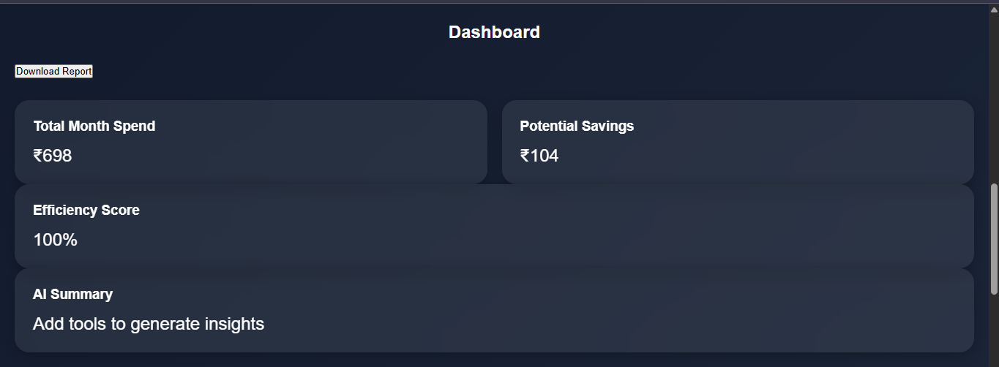

# AI Spend Analyzer 💸

AI Spend Analyzer is a smart dashboard that helps teams track AI tool expenses, visualize spending patterns, calculate potential savings, and generate downloadable reports.

## Features
- AI expense tracking
- Interactive pie chart dashboard
- Spending insights
- Efficiency score
- Local storage support
- Downloadable reports
- Responsive UI

## Technologies Used
- HTML
- CSS
- JavaScript
- Chart.js

## Live Demo
ai-spend-analyzer.netlify.app

## Screenshots

## Developed By
Riya Jaiswal
